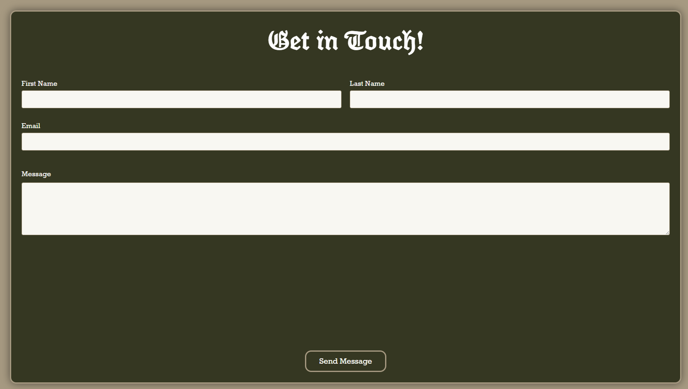
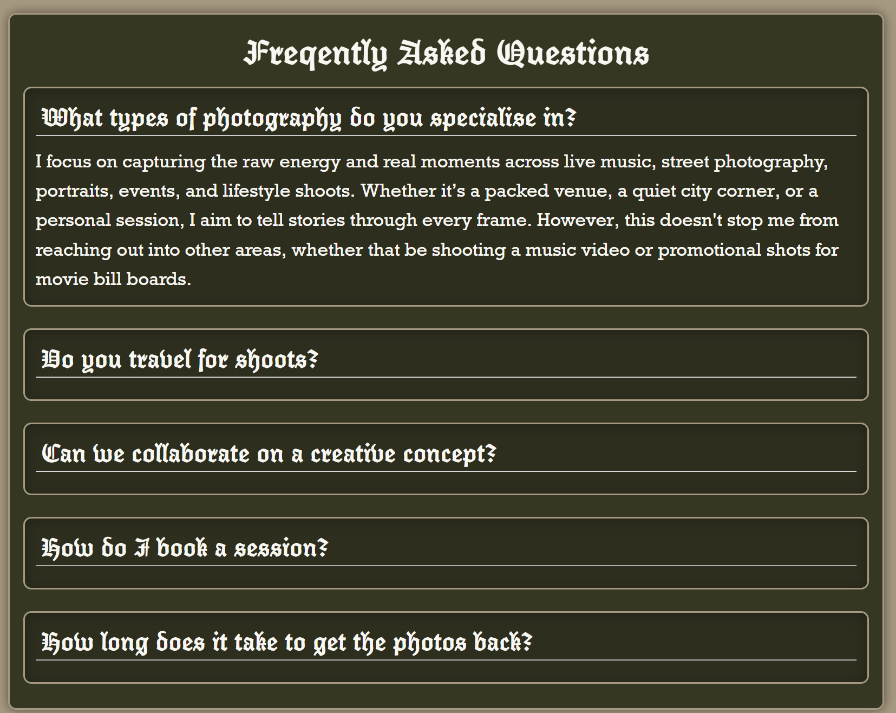
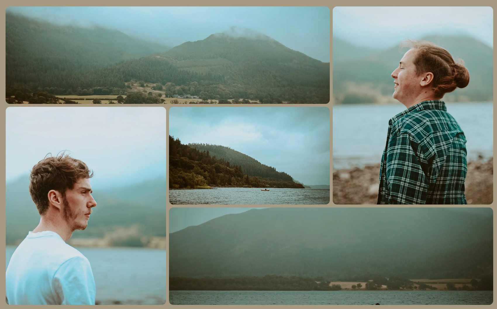
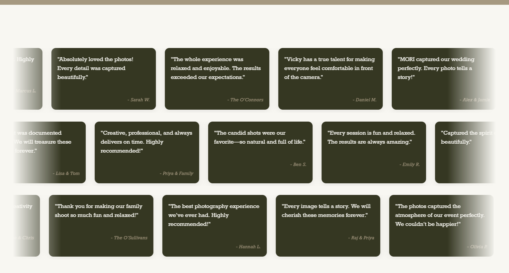

# MORI-Visuals-Website

A custom e-commerce solution for a professional solo photography business under the name of MORI (mxri-visuals). The proposed e-commerce solution allows for MORI so have a centralised hub for their clients to find them organically through google search and SEO or through direct linking within their socials. The website enables MORI to display both highlights from their current work as well as an extended gallery with a wider selection of their work. Included within the solution also enables users to directly contact MORI via a form which will send an email with the users enquiry direcly to MORI's email. By introducing this e-commerce solution into MORI's workflow, it will help create a professional image for their brand and introduce an additional source of customer lick through for the business.

## Screenshots






## Features

  -  Direct contact form for customers which well send submitted details directly to MORI's email
  -  Highlight and extended gallery for displaying previous work
  -  Responsive design layout suitable for all platforms, including ultra wide monitors and mobile devices
  -  Animated content for enhanced user experience 

## Tech Stack

Frontend: HTML, CSS, JavaScript
Backend: PHP
Database: NA
Tools: VS Code, Photoshop, Github

## Folder Structure

/
├── css/
│   ├── about/
│   │   └── aboutDefault.css
│   ├── contact/
│   │   └── contactDefaults.css
│   ├── gallery/
│   │   └── galleryDefault.css
│   ├── home/
│   │   ├── aboutSection.css
│   │   ├── contactSection.css
│   │   ├── gallerySection.css
│   │   ├── homeDefault.css
│   │   └── testimonialSection.css
│   ├── terms/
│   │   └── terms.css
│   ├── defaults.css
│   ├── footer.css
│   └── navBar.css
├── images/
│   ├── about/
│   ├── footer/
│   ├── galleryPage/
│   │   ├── BTS/
│   │   ├── gig/
│   │   ├── nature/
│   │   └── street/
│   ├── header/
│   └── homePage/
│       ├── aboutSection/
│       └── gallerySection/
├── js/
│   ├── fadeInOnScroll.js
│   ├── faqToggleBox.js
│   ├── headerSlideshow.js
│   ├── navSmall.js
│   └── testimonialAutoScroll.js
├── about.html
├── accessibility.html
├── contact.html
├── gallery.html
├── index.html
├── privacy.html
├── refund.html
├── terms.html

<pre> ``` / ├── css/ │ ├── about/ │ │ └── aboutDefault.css │ ├── contact/ │ │ └── contactDefaults.css │ ├── gallery/ │ │ └── galleryDefault.css │ ├── home/ │ │ ├── aboutSection.css │ │ ├── contactSection.css │ │ ├── gallerySection.css │ │ ├── homeDefault.css │ │ └── testimonialSection.css │ ├── terms/ │ │ └── terms.css │ ├── defaults.css │ ├── footer.css │ └── navBar.css ├── images/ │ ├── about/ │ ├── footer/ │ ├── galleryPage/ │ │ ├── BTS/ │ │ ├── gig/ │ │ ├── nature/ │ │ └── street/ │ ├── header/ │ └── homePage/ │ ├── aboutSection/ │ └── gallerySection/ ├── js/ │ ├── fadeInOnScroll.js │ ├── faqToggleBox.js │ ├── headerSlideshow.js │ ├── navSmall.js │ └── testimonialAutoScroll.js ├── about.html ├── accessibility.html ├── contact.html ├── gallery.html ├── index.html ├── privacy.html ├── refund.html └── terms.html ``` </pre>

## Author
Name:      Reece K. Mott
LinkedIn:  https://www.linkedin.com/in/reece-mott-7329b6312/
GitHub:    https://github.com/RKMott

## License

This project is for viewing purposes only.
All rights reserved
See LICENSE for more information


